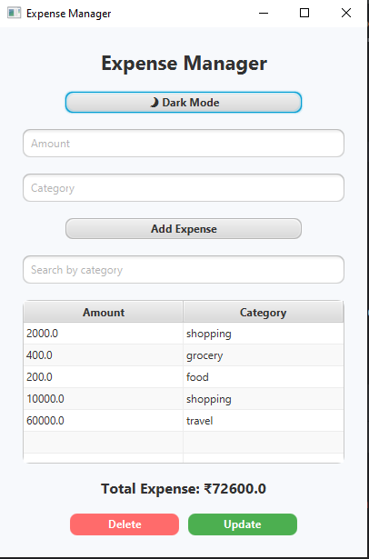
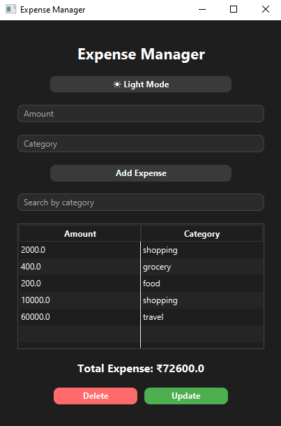

#  Expense Manager (JavaFX)

A desktop-based **Expense Management Application** built using **JavaFX**, following the **MVC architecture**.

This project was created **to understand and strengthen core Java concepts** such as:
- Object-Oriented Programming (OOP)
- Event handling
- Exception handling
- File handling
- Collections
- JavaFX UI development

The application also focuses on clean UI design, dark/light mode support, and persistent data storage.
---

##  Features

-  Add expenses with amount and category
- ️ Edit selected expenses
-  Delete expenses
-  Search / filter expenses by category
-  Automatic total expense calculation
-  File-based persistence (data saved across restarts)
-  Light & Dark mode toggle
-  Clean UI styled using JavaFX CSS

---

##  Tech Stack

- **Java**
- **JavaFX** (FXML + CSS)
- **Core Java I/O** (File handling)
- **MVC Architecture**

---

##  Project Structure

ExpenseManager/ 
├── src/main/java/com/example/expensemanager
│ ├── HelloApplication.java
│ ├── HelloController.java
│ └── Expense.java
│
├── src/main/resources/com/example/expensemanager
│ ├── hello-view.fxml
│ ├── style.css
│ └── dark.css
│
├── expenses.txt
└── README.md

---

## ️ How to Run the Project

1. Clone the repository
2. Open the project in **IntelliJ IDEA**
3. Make sure **JavaFX is configured**
4. Run `HelloApplication.java`

---

##  Screenshots

---

##  What I Learned

- Building JavaFX applications using MVC architecture
- Handling UI events and validations
- Implementing CRUD operations
- Using `FilteredList` for search functionality
- Styling JavaFX applications with CSS
- Implementing dark/light theme switching
- Debugging real-world JavaFX UI issues

---

##  Author

**Sakshi Mathure**  
MCA Student | Java & Full Stack Enthusiast

---

If you like this project, feel free to star the repository!
